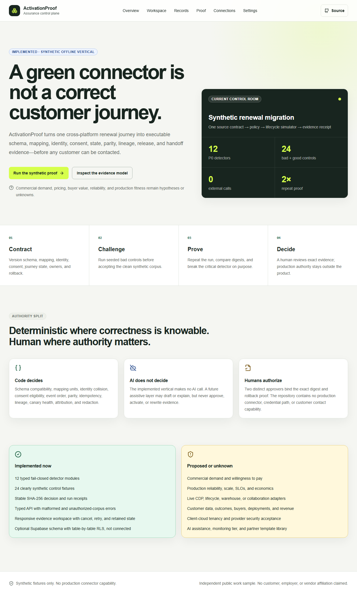

# ActivationProof

ActivationProof is an activation assurance control plane for cross-platform MarTech delivery. It proves whether one synthetic CDP-to-lifecycle renewal journey preserves schema, mapping, identity, consent, state, parity, idempotency, lineage, attribution, release authority, and a redacted handoff.

This repository contains a real, runnable vertical—not a landing-page prototype. It is also deliberately bounded: no customer data, production connector, provider credential, deployment, user, commercial outcome, or employer affiliation is claimed.



## The problem

A connector can be healthy while the business journey is wrong. A `200 OK` does not prove that:

- cents became dollars correctly;
- two people sharing an email were not merged;
- an opted-out person was suppressed before adapter creation;
- events advanced through the right state exactly once;
- legacy and target journeys remained equivalent;
- a timeout after possible provider commit was reconciled rather than blindly retried;
- every decision can be traced from source to acknowledgement and recovered.

ActivationProof answers those questions with typed, deterministic controls and evidence receipts.

## Who it is for

The primary user hypothesis is a MarTech solutions architect accountable for a multi-platform migration or high-value lifecycle journey. Secondary users may include data, lifecycle operations, implementation QA, security/privacy, and client acceptance owners. Buyer, demand, willingness to pay, and commercial value remain unvalidated hypotheses.

## The implemented workflow

1. Open the synthetic renewal contract in `/workspace`.
2. Inspect the source → decision → destination simulator → evidence boundary.
3. Run 12 known-bad controls before 12 paired clean controls.
4. Verify all 24 expected decisions and exactly zero external calls.
5. Repeat the corpus and compare the stable SHA-256 run digest.
6. Disable the critical consent detector and prove its control suite fails.
7. Restore the detector and prove the same suite passes.
8. Inspect recovery, RLS proposal, connection boundaries, and redacted receipts.

No step contacts a provider or customer.

## Architecture

```text
Next.js 16 UI
  -> typed assurance API
    -> AssuranceService
      -> 12 deterministic detector modules
      -> repository-owned synthetic fixtures
      -> canonical decision receipts + SHA-256 digest

Optional, not connected:
  Supabase schema -> RLS on every table -> tenant-scoped policies
```

See [architecture](docs/ARCHITECTURE.md), [security/privacy](docs/SECURITY.md), and the [operator runbook](docs/OPERATIONS.md).

## Deterministic / AI / human split

- **Deterministic code:** owns every implemented decision. Controls are versioned and fail closed.
- **AI:** absent from the implemented runtime. A proposed assistive layer may draft or explain, but cannot decide identity, consent, mapping, approval, release, or evidence.
- **Human:** reviews exact receipts and owns any future sandbox or production authority. Two distinct approvers, exact digest equality, and rollback proof are required even for bounded sandbox authorization.

## Evidence receipts

Every control emits `DecisionReceipt.v1` with:

- fixture, requirement, and detector identity;
- detector version and health;
- business decision (`PASS`, `REJECT`, or `UNKNOWN`);
- issue codes and finding count;
- `externalCallCount: 0`;
- `dataClass: SYNTHETIC`;
- stable SHA-256 evidence digest.

Detector health and business result are different fields. A broken detector can never turn an empty result into a clean claim.

## Local setup

Requirements: Node.js 20.9+ and npm.

```powershell
git clone https://github.com/shrishmanglik/activation-proof.git
cd activation-proof
npm.cmd ci
npm.cmd run dev
```

Open `http://localhost:3000` and choose **Run the synthetic proof**. No environment variable is required.

## Tests and proof commands

```powershell
npm.cmd run control:consent   # bad rejection + clean control
npm.cmd test                  # controls, repeatability, API, security, recovery
npm.cmd run typecheck
npm.cmd run lint
npm.cmd run build
npm.cmd run e2e               # desktop + 390px-class mobile journey and accessibility
```

Critical mutation proof:

```powershell
$env:ACTIVATIONPROOF_DISABLE_DETECTOR='CV-R4'
npm.cmd run control:consent   # must fail
Remove-Item Env:ACTIVATIONPROOF_DISABLE_DETECTOR
npm.cmd run control:consent   # must pass
```

Exact command outputs and evidence-class boundaries are recorded in the [build evidence manifest](docs/evidence/initial-build-manifest.md).

## Security and privacy

- Synthetic fixtures only; example identifiers are explicitly tokenized and non-personal.
- No credential entry or secret read path.
- No external request from the assurance engine.
- No production adapter, webhook, customer-contact path, or blind retry.
- The optional Supabase migration enables RLS on every application table and revokes anonymous access; it has not been applied to a provider.
- Export controls reject raw email/access-token field classes, unresolved ownerless exceptions, and missing replay instructions.

## Commercial hypothesis—not evidence

The hypothesis is that a bounded assurance engagement for one high-value cross-platform journey could reduce escaped semantic defects and client acceptance ambiguity. The repository does not prove market demand, pricing, savings, delivery margin, reliability, scale, customer value, or repeat use. Those require qualified buyer commitment, observed delivery evidence, provider proof, and commercial receipts.

## Implemented vs proposed

| Capability | State |
| --- | --- |
| Responsive recruiter-inspectable UI and primary workflow | Implemented locally |
| 12 P0 deterministic detectors / 24 synthetic controls | Implemented locally |
| Stable evidence and second-run digest | Implemented locally |
| Critical consent-detector mutation control | Implemented locally |
| Typed API allowlisting the synthetic corpus | Implemented locally |
| Supabase schema and table-by-table RLS policies | Source proposal; not applied |
| Authentication and tenant provisioning | Proposed |
| CDP, lifecycle, warehouse, analytics, or collaboration integrations | Proposed; not connected |
| AI assistance | Proposed; absent from authoritative path |
| Production deployment, reliability, users, customers, revenue | Unknown / not authorized |

## Roadmap gates

1. Obtain independent review of this source and evidence.
2. Validate the problem with qualified buyers before building connector breadth.
3. Add authentication and prove RLS against a local Supabase instance before any provider project.
4. Implement one sandbox adapter only after authority, idempotency, reconciliation, and security contracts are approved.
5. Run a separately authorized shadow proof with safe data; keep the current process authoritative.
6. Consider recurring monitoring only after paid repeat-use evidence exists.

## Evidence boundary and provenance

The product blueprint was candidate-authored from public company/job context and private application workflow material. That material is not included here. This repository is an independent product implementation and does not claim endorsement, affiliation, internal knowledge, customer demand, or direct platform experience.

The repository is publicly inspectable. No reuse license is granted at this stage; default copyright applies.
